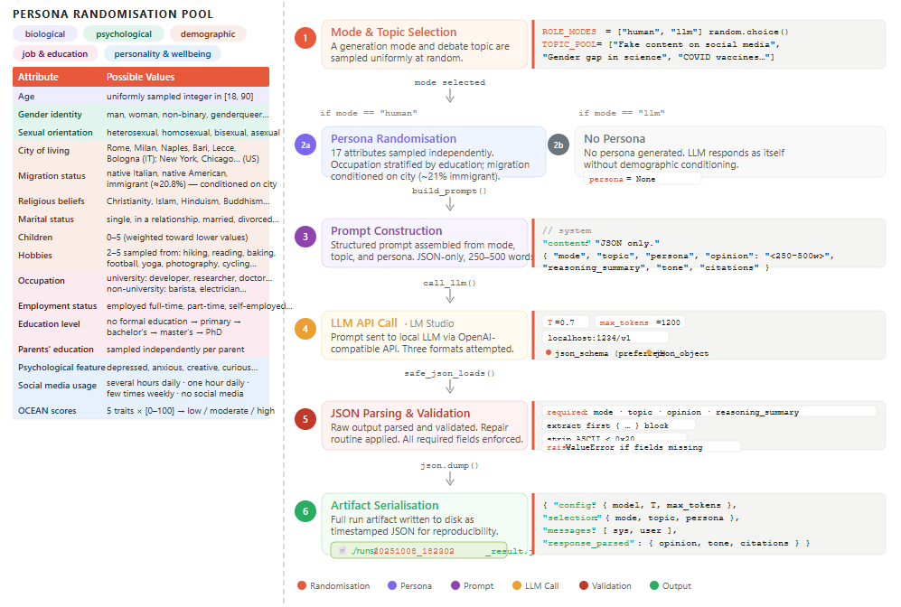
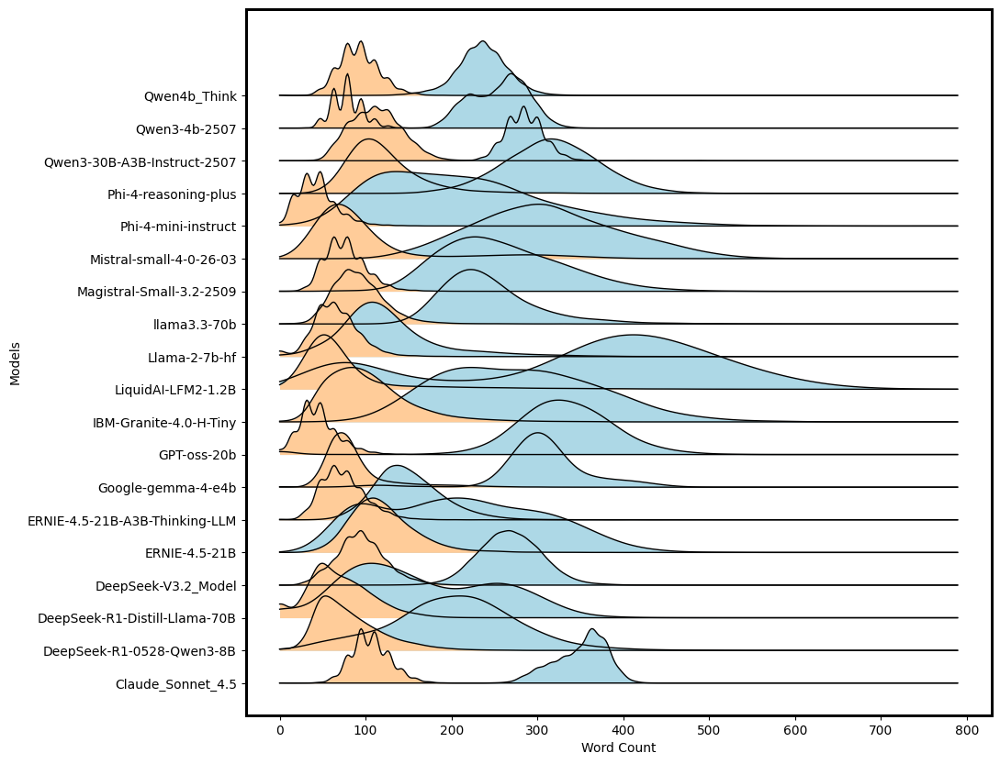
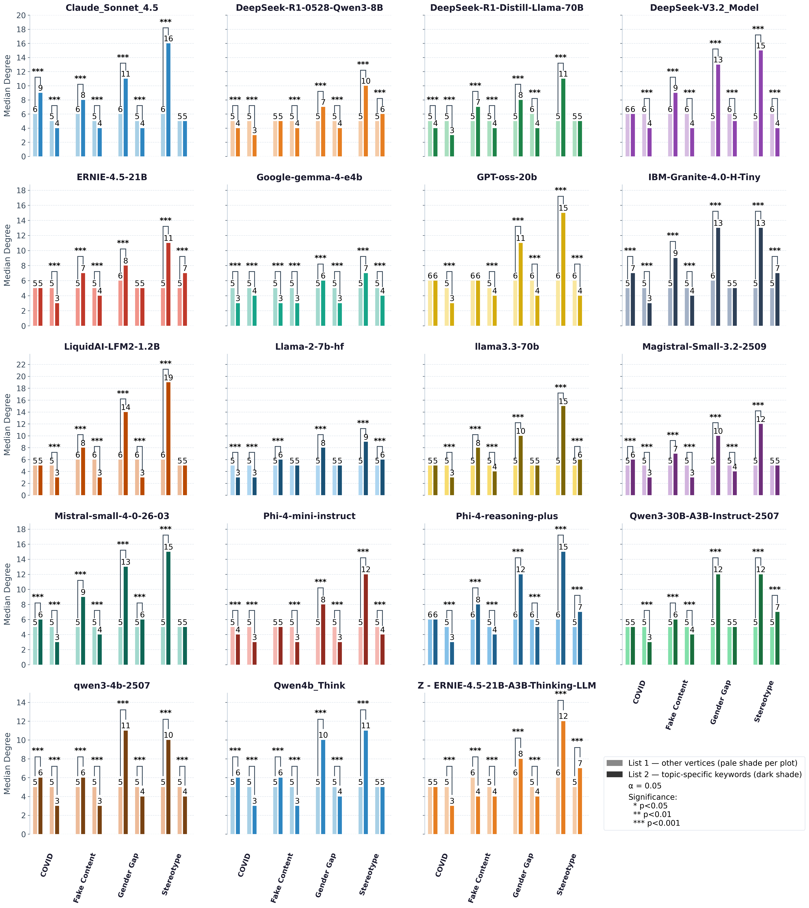
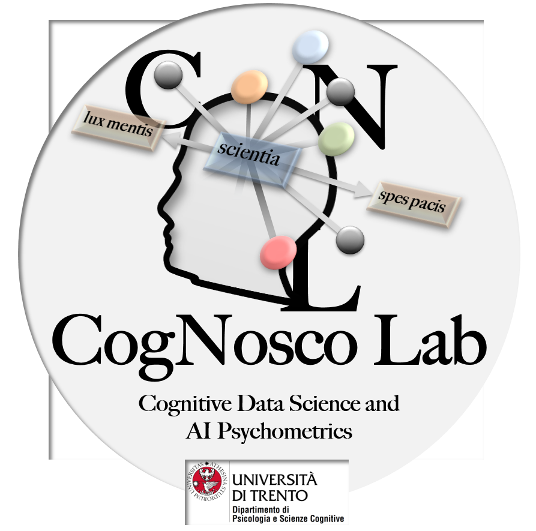

<p align="center">
  
  
</p>

<p align="center">
  FIS2 Project PENSO - Funded by MUR - CogNosco Lab, University of Trento
</p>

<h1 align="center">
  Cognitive Digital Shadows (CDS) Dataset
</h1>

<p align="center">
  🤖 LLMs · 🧮 Dataset · 💬 Opinion Pooling · 🤔 Reasoning · 📊 Social Media
</p>


## **Overview**

This repository contains a **Dataset** and a **Pooling Data System** designed to aggregate and analyse textual outputs generated by **large language models (LLMs)** under **controlled prompting conditions**.

The system enables users to specify both a **topic** and a **sociodemographic pool**, and to collect all LLM-generated texts that satisfy the corresponding pooling request. The resulting pooled corpus is then analysed to extract multiple layers of **structured semantic and affective information**.

The repository is relative to Cognitive Digital Shadows (CDS), a synthetic corpus of about 190,000 LLM-generated debate records designed to study how large language models discuss socially sensitive issues under controlled prompt conditions.

# Please cite this work if you use the pooling data system:
Aghazadeh Ardebili, A., & Stella, M. Mapping how LLMs debate societal issues when shadowing human personality traits, sociodemographics and social media behavior [Preprint]. University of Trento, CogNosco Lab.

---
---
## **Graphical Abstract**

 

---
## **Word count**
Distributions of word count across opinion and reasoning summary layers for all models in the corpus. 

 

---

## **Validation _ KW**

Kruskal–Wallis test results comparing the node degree of C_kwd against all other vertices across textual forma mentis networks (TFMNs) extracted from debates generated by 19 large language models (LLMs) on four controversial topics (Vaccine-Covid, FakeNews, Gender Gap, Stereotype-STEM), each analyzed at two layers (Opinion and Reasoning_Summary). For each topic-layer combination, the node degree (a measure of conceptual centrality within the TFMN) is compared between C_kwd (list2, dark shade) and the remaining non-stopword, non-topic-word vertices (list1, pale shade) using a non-parametric test. Statistical comparisons were conducted using the Kruskal–Wallis rank-sum test via scipy.stats.kruskal. Brackets are omitted when the median node degree of C_kwd equals that of list1. Each subplot corresponds to one LLM, with bar color uniquely assigned per model. For each topic, two bar pairs are shown: the left pair represents the Opinion layer and the right pair represents the Reasoning Summary layer. The H-statistic is reported below each topic-layer pair. Subplots within the same row share a common y-axis scale. All tests were conducted at significance level alpha = 0.05.

 

---

## **Core Capabilities**

The system supports the extraction of the following analytical representations:

- **Semantic Frames**  
  Capturing recurring **conceptual structures** and **meaning patterns** across pooled texts.

- **Mindset Streams**  
  Representing dominant **cognitive**, **interpretative**, and **discursive orientations**.

- **Emotional Flowers**  
  Modelling the **distribution**, **intensity**, and **co-occurrence** of affective states.

- **Rankings**  
  Enabling **comparative evaluation** across semantic frames, mindset streams, and emotional dimensions.

---

## **Purpose**

By combining **controlled data pooling** with **multi-level analytical representations**, the system provides a **reproducible framework** for studying how LLM-generated discourse varies across **topics** and **sociodemographic configurations**.

---

## 🤖 Models Included


Claude_Sonnet_4.5

DeepSeek-R1-0528-Qwen3-8B

DeepSeek-R1-Distill-Llama-70B

DeepSeek-V3.2_Model

ERNIE-4.5-21B

Google-gemma-4-e4b

GPT-oss-20b

IBM-Granite-4.0-H-Tiny

LiquidAI-LFM2-1.2B

Llama-2-7b-hf

llama3.3-70b

Magistral-Small-3.2-2509

Mistral-small-4-0-26-03

Phi-4-mini-instruct

Phi-4-reasoning-plus

Qwen3-30B-A3B-Instruct-2507

qwen3-4b-2507

Qwen4b_Think

ERNIE-4.5-21B-A3B-Thinking-LLM

-----------------------------------------------------


```
Structure of the repository:.
PENSO_Data_WP-ConvinceMe_FIS2_UniTrento/
├── Code/
├── Data/
│   ├── Processed_Data/
│   │   ├── Data_visualization/
│   │   │   └── [19 LLM folders]
│   │   ├── EdgeList/
│   │   │   └── [19 LLM folders, some with PKL_version_of_edgelists/]
│   │   ├── Hypothesis_Testing/
│   │   │   └── [19 LLM folders]
│   │   └── TFMN_EmoA_stats/
│   └── Raw_Data/
│   │   ├── Claude_Sonnet_4.5/
│   │   ├── DeepSeek-R1-0528-Qwen3-8B/
│   │   ├── DeepSeek-R1-Distill-Llama-70B/
│   │   ├── DeepSeek-V3.2_Model/
│   │   ├── ERNIE-4.5-21B/
│   │   ├── ERNIE-4.5-21B-A3B-Thinking-LLM/
│   │   ├── Google-gemma-4-e4b/
│   │   ├── GPT-oss-20b/
│   │   ├── IBM-Granite-4.0-H-Tiny/
│   │   ├── LiquidAI-LFM2-1.2B/
│   │   ├── Llama-2-7b-hf/
│   │   ├── llama3.3-70b/
│   │   ├── Magistral-Small-3.2-2509/
│   │   ├── Mistral-small-4-0-26-03/
│   │   ├── Phi-4-mini-instruct/
│   │   ├── Phi-4-reasoning-plus/
│   │   ├── Qwen3-30B-A3B-Instruct-2507/
│   │   ├── Qwen3-4b-2507/
│   │   └── Qwen4b_Think/
└── Data Pooling System/


```

## Created within CogNosco Lab - Check our Research: https://cognosco.dipsco.unitn.it/

<p align="center">
  
  
</p>

## Acknowledgements

This work is part of the PENSO project, supported by the Ministero dell'Università e della Ricerca (MUR)
according to Decreto N. 23178 of 10 dicembre 2024 — Bando FIS 2. The authors acknowledge support from
CALCOLO, funded by Fondazione VRT, for support with the computational infrastructure simulating LLMs.

